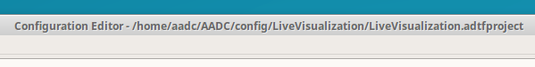
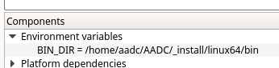
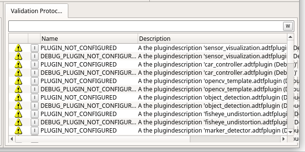
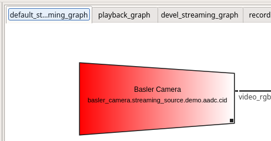
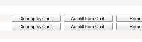
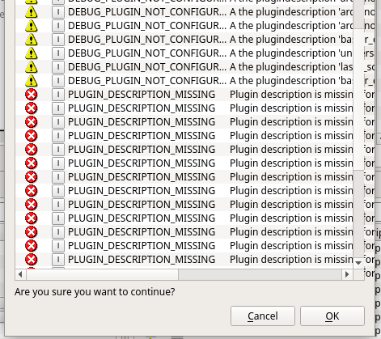
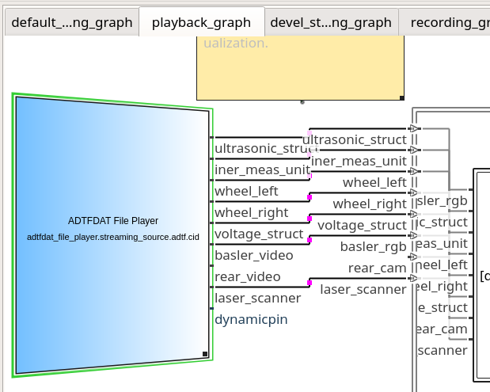
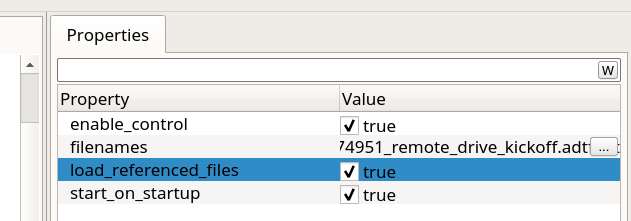
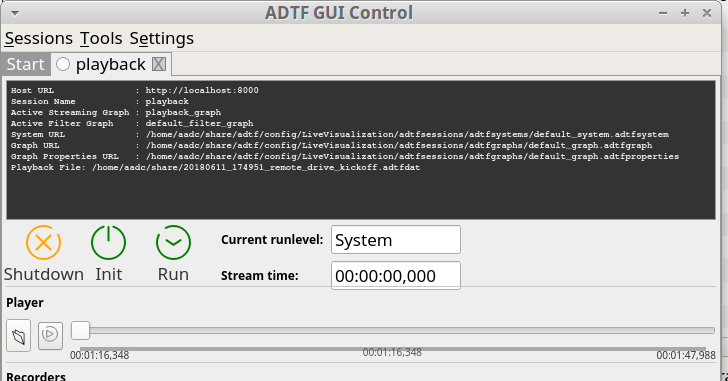
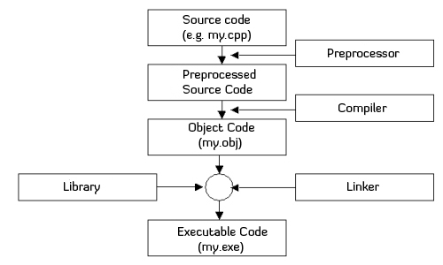

# Common ADTF Pitfalls

## Abbreviations

- `src\aadcBase -> base` *(do not change)*
- `src\aadcDemo -> demo` *(examples)*
- `src\aadcUser -> user` *(our code base)*
- **Repository Root:** The `AADC` or `adtf` folder
- **Project Root:** The `base`, `demo` or `user` folder
- **Filter Root:** The directory of your filter, within `base`, `demo` or `user`

## How to code

- Do not directly edit code in `base` or `demo`! Instead, copy the filter to `user`, give it a new id in the header file and work from there.
- Always copy an existing filter and adjust the code from there.
- **Get familiar with Git.** [Here](http://rogerdudler.github.io/git-guide/) is the shortest and most effective guide on Git.

## How to get a clean build

Use

    .\clean_build_user.sh

This will remove the `_install`, `_build_user` and `_build_user_debug` folders before doing a build of `base`, `demo` and `user`.

For even more cleanage, remove everything and build `base`, `demo` and then `user`.

    rm -rf _build* _install
    .\_build_base.sh
    .\_build_demo.sh
    .\_build_user.sh

**Moreover, make sure to start from a clean commit.** I will not explain how to use Git here, Google can help you.

## How to clean your ADTF session

- Make sure that you loaded the correct project. This is visible in the header. There are two projects, the main one being `~/AADC` and a network-shared one at `~/share/adtf`.

    

- There is a **global (!)** setting for where ADTF is searching for plugins. This needs to be set to the `_install/linux64/bin/*/*.adtfplugin` directory of your loaded project.

    

    To avoid changing this variable every time you reload a project, i specified this with an environment variable to `$(PROJECT_ROOT)/_install/linux64/bin/*/*.adtfplugin`.

    The environment variable `PROJECT_ROOT` is set by the start-up script of the Configuration Editor in `~/scripts/start_adtf_ce.sh` (setting it to `/home/aadc/AADC`) and `~/scripts/start_adtf_ce_share.sh` (setting it to `/home/aadc/share/adtf`).

- There is a **project-wide (!)** setting for the `BIN_DIR` that must point to `_install/linux64/bin`. **Since this a project-wide setting, a `git pull` can reset this. Always check if it is set correctly.**

    This setting should **always** point to `/home/aadc/AADC/_install/linux64/bin`. If you are working from the network share, make sure to not commit the changes, that change this variable if you are manually changing it.

    

- Upon double-clicking a session, there shouldn't be any warnings, errors or red blocks in the graph editor!

    

    

    If there are errors, select *Remove All* and then *Autofill from Conf.* on _both buttons_ (!) and hit *OK* in the pop-up.

    

    

- **Save the project, close the Configuration Editor and re-open it again.**
    - Do not close without saving.
    - Do not close the project, because it will hang then. Just close the window.

## CMake Pitfalls

- Add your filter to the `CMakeLists.txt`, otherwise it will not be built and also not appear in your IDE.
- Add ysniour source files and headers in the `SET ( SOURCEFILES` directive in the filter root.
- The order of CMake commands **is important**.

## Getting the `playback` session running

- Download the [recorded playback file](https://drive.google.com/file/d/1u-Q3-PNzzWi9EFRohAAP1TBIGv9XkkuE/view?usp=sharing) from the AADC team and put it somewhere.
- Load the project in the configuration editor, double click the `playback` session, switch to the streaming graph and select the `playback_graph`.

    

    - Remove the `rear_video` connection (second last connection) by right-clicking the pink dot and selecting _Delete_. The playback file doesn't contain the rear video stream, therefore we need to get rid of this connection.
    - Select the _ADTFDAT File Player_ streaming source, such that the properties show up on the right. Then, click the three dots in the `filenames` property column and choose the path to the downloaded and extracted `*.adtfdat` record file. **Important! Even if the path is already correct, re-chose the same file, because ADTF sucks and can't save property values properly.**

    

- **Save the session (!)** and then right-click on it to start it with the GUI Control. In here, click the directory-icon below the _Player_ label and choose the `*.adtfdat` record file once again.

    

- **Init** and **run** the session. You are ready to go!

## Details

### The bare minimum you need to know about C/C++

In C++, `*.h` files hold definitions and `*.cpp` files hold implementations. Before compilation, source code is preprocessed, e.g. macors and templates are expanded. Next, the source will be compiled to so-called object files.

If you use libraries in your code, the linker handels the references to them. There are to ways on how this can be done:

- **Statically linked binaries:** You give the Linker the library and it will directly embed the code from the library into your executable. You do not need the library afterwards. 
- **Dynamically linked binaries:** Much more common. You tell the linker where your library is located (usually in a global location in your system) and it will just keep a reference to it (like `import` in Python). If your library is missing during execution, your program will crash.

At the AADC, we are not building executables, we are building libraries again, also called *shared objects*. Why you ask? Because the framework will include our code like a library and we are not directly executing our filters.

### How CMake manages our projects

There are three C++ projects, `base`, `demo` and `user`. Each C++ project is specified with the `CMakeLists.txt` in its project root.

In there, the `AADC` package is included from the repository root of the `AADC` folder (`AADCConfig.cmake`). This loads ADTF, QT, OpenCV, Boost and Pylon & RPLidar SDKs (nothing else, no Tensorflow, no magic).

If the package `QT` was loaded successfully, the variable `QT_FOUND` will be set to `True`. Furthermore, `QT_LIBS` will hold the loaded libraries. CMake will search for the package in the path specified by `QT_DIR`. And it will search for libraries in `QT_LIBRARY_DIRS` and for header files in `QT_INCLUDE_DIRS`.
