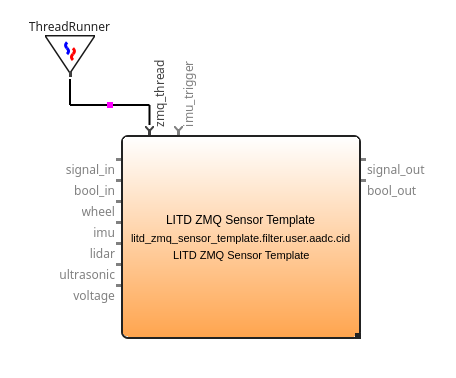

# How To: ZeroMQ Filters

> ZeroMQ is the Answer!

[ZeroMQ](http://zeromq.org/) is a low-overhead, low-latency, high-speed IPC library, which is used for pumping sensor data to a message queue and receiving it with another process, e.g. Python.
ZeroMQ has a wide variety of [language bindings](http://zeromq.org/bindings:_start) for various programming languages.

## Prerequisites

### Installing ZeroMQ on your system

- On Linux, install the library like so:

    ```bash
    cd /opt
    sudo git clone https://github.com/zeromq/libzmq.git
    sudo chown -R aadc:aadc libzmq
    cd /opt/libzmq
    mkdir build; cd build
    cmake ..
    make
    ```
- On Windows, do the following:

    ```bash
    cd C:\SDKs
    git clone https://github.com/zeromq/libzmq.git
    md build; cd build
    cmake -G "Visual Studio 14 2015 Win64" ..
    cmake --build . --target INSTALL --config Release
    ```

### Referencing ZeroMQ in your CMake configuration

- In your [`AADCConfig.cmake`](/AADCConfig.cmake), add the following snippet to reference the  binaries and include directories for ZeroMQ:

    ```cmake
    if(UNIX)
        set(ZMQ_DIR "/opt/libzmq")
        set(ZMQ_LIBRARY_DIRS "${ZMQ_DIR}/build/lib")
    else(UNIX)
        set(ZMQ_DIR "C:/SDK/libzmq")
        set(ZMQ_LIBRARY_DIRS "${ZMQ_DIR}/build/lib/Release")
    endif(UNIX)

    set(ZMQ_INCLUDE_DIRS "${ZMQ_DIR}/include")

    FIND_LIBRARY(ZMQ_LIBS NAMES
            libzmq.a
            libzmq-v140-mt-4_3_1
            PATHS
            "${ZMQ_LIBRARY_DIRS}"
            )

    if (ZMQ_LIBS)
        message(STATUS "Found ZeroMQ. ZeroMQ lib dir is: ${ZMQ_LIBRARY_DIRS}")
        set(AADC_ZMQ_FOUND TRUE)
    else (ZMQ_LIBS)
        message(FATAL_ERROR "ZeroMQ libs not found under ${ZMQ_LIBRARY_DIRS}")
    endif (ZMQ_LIBS)
    ```

## Using one of the template ZMQ Filters

There are already some template filters implemented, to get you started right away. These are located in [`src/aadcUser/templates`](/src/aadcUser/templates). The two most interesting are probably:

- `LITD_ZMQ_ImageTemplate` accepts image media types on its input
- `LITD_ZMQ_SensorTemplate` accepts some signal values, wheel encoder, imu, lidar, ultrasonic and voltage data while outputting only signal values.

If you compile the project, you should see those filters in the ADTF Configuration Editor right away.

## Creating your own ZMQ Filter

- Create a new directory for the filter in [`src/aadcUser`](/src/aadcUser). We will create a `MyFirstZmqFilter` directory in this example.
- You will need a `CMakeLists.txt` that includes the `ZMQ_INCLUDE_DIRS` and links against the `ZMQ_LIBS`:

    ```cmake
    cmake_minimum_required(VERSION 3.10.0)

    project(my_first_zmq_filter)

    if (NOT TARGET adtf::ui)
        find_package(ADTF COMPONENTS filtersdk ui)
    endif()

    include_directories(${ZMQ_INCLUDE_DIRS})

    set (HEADERS MyFirstZmqFilter.h ../utils/zeromq/ZmqBase.h)
    set (SOURCES MyFirstZmqFilter.cpp ../utils/zeromq/ZmqBase.cpp)

    adtf_add_filter(${PROJECT_NAME} ${HEADERS} ${SOURCES})

    target_include_directories(${PROJECT_NAME} PUBLIC .)

    adtf_install_target(${PROJECT_NAME} bin)

    adtf_create_plugindescription(
        TARGET ${PROJECT_NAME}
        PLUGIN_SUBDIR "bin"
    )

    target_link_libraries(${PROJECT_NAME} LINK_PUBLIC ${ZMQ_LIBS})
    ```
- Next up, create the header file `MyFirstZmqFilter.h`:

    ```cpp
    #pragma once

    #include "../utils/zeromq/ZmqBase.h"

    #define CID_MY_FIRST_ZMQ_FILTER  "my_first_zmq_filter.filter.user.aadc.cid"
    #define LABEL_MY_FIRST_ZMQ_FILTER  "My First ZMQ Filter"

    class cMyFirstZmqFilter : public cZmqBase
    {
    public:
        ADTF_CLASS_ID_NAME(cMyFirstZmqFilter, CID_MY_FIRST_ZMQ_FILTER, LABEL_MY_FIRST_ZMQ_FILTER);

        ADTF_CLASS_DEPENDENCIES(REQUIRE_INTERFACE(IZeroMQService),
            REQUIRE_INTERFACE(adtf::services::IReferenceClock));

        cMyFirstZmqFilter();
    };
    ```
- And finally, the source file `MyFirstZmqFilter.cpp`:

    ```cpp
    #include "MyFirstZmqFilter.h"

    ADTF_PLUGIN(LABEL_MY_FIRST_ZMQ_FILTER, cMyFirstZmqFilter)

    cMyFirstZmqFilter::cMyFirstZmqFilter()
    {
        // input pin names and types
        m_inputs.emplace_back("signal_in", SignalValue);
        m_inputs.emplace_back("bool_in", BoolSignalValue);
        m_inputs.emplace_back("wheel", WheelData);
        m_inputs.emplace_back("imu", InerMeasUnitData);
        m_inputs.emplace_back("lidar", LaserScanner);
        m_inputs.emplace_back("ultrasonic", Ultrasonic);
        m_inputs.emplace_back("voltage", Voltage);

        // output pin names and types
        m_outputs.emplace_back("signal_out", SignalValue);
        m_outputs.emplace_back("bool_out", BoolSignalValue);

        // pipe out the data whenever there are new samples on these pins
        m_triggers.emplace_back("imu");

        // should we use GetNextSample() instead of GetLastSample()
	    m_next_sample_trigger = false;
    }
    ```

You can specify as many input and output pins as you want.
The available pin types can be observed in the `eZmqStruct` enum in [`ZmqBase.h`](/src/aadcUser/utils/zeromq/ZmqBase.h).
If you want more data types, you need to implement them in [`ZmqBase.cpp`](/src/aadcUser/utils/zeromq/ZmqBase.cpp).

You can specify one or more triggers. If any trigger occurs, everything will be sent to the specified socket. There is no way to only send a few input pins.

You can omit the output pins. You shouldn't omit the input pins though, because nothing can trigger your filter then. One way to workaround this is to create a simple `signal` input pin and attach a _Timer Runner_ in ADTF to trigger the filter.

## Placing a ZMQ Filter in the ADTF Configuration Editor

| :warning: **If you place the filter in the graph, you have to connect a _Thread Runner_ to the `zmq_thread` pin as well, with its property `thread_is_cyclic` set to `false`!** |
|--------------|



If you want your filter to be time-triggered, create a `signal` input pin and attach a _Timer Runner_ to the `signal_trigger` pin. If the filter is triggered, it will send an empty message to the server (since the `signal` pin is not attached) and awaits its reply.

### ZMQ Filter Properties

- **Socket Address:** Specify the server socket address, one of:
    - `tcp://ip:port` for transmitting data over the [network stack with TCP](http://api.zeromq.org/4-1:zmq-tcp)
    - `ipc:///tmp/endpoint/0` for using os-dependent [IPC techniques](http://api.zeromq.org/4-1:zmq-ipc)
    - `inproc://endpoint` for using [in-process communication](http://api.zeromq.org/4-1:zmq-inproc)
- **Queue Length:** How many messages shall be queued in memory at a maximum (actual limit might be 60 - 70% lower, see [ZeroMQ API docs](http://api.zeromq.org/4-1:zmq-setsockopt#toc39))
- **Subsample Factor:** Only take every n-th trigger, skip the rest

TCP is quite reliable and fast, even on `localhost`.
On Linux you can also opt for IPC with named pipes, with [`mkfifo`](https://linux.die.net/man/3/mkfifo).

## Receiving input samples and replying output samples

You need to code the server part yourself. Although, you can build upon or even use the Python implementation in [`litdrive.zeromq.server`](/src/aadcUserPython/litdrive/litdrive/zeromq/server.py).

If you are going to implement your own server in another language, you might want to consider the interface details listed below.

There are even some example implementations in Python, that just require you to code a `process()` method. Find them in the [`litdrive.zeromq.demo`](/src/aadcUserPython/litdrive/litdrive/zeromq/demo) package.

```python
import json

from litdrive.zeromq.server import ZmqServer


# pretty-print the input samples and do not send anything back
def process(imu, lidar):
    print(json.dumps([imu, lidar], indent=2))


# open a server for the ADTF filter
zmq = ZmqServer("tcp://*:5555", ["tInerMeasUnitData", "tLaserScannerData"])

try:
    zmq.connect()
    zmq.run(process, return_dict=True)
finally:
    zmq.disconnect()
```

If you use `return_dict=True`, the input samples will be unpacked into a nicely formatted dictionary.
If performance is key to you, you might want to avoid this and get the raw tuples instead with `return_dict=False`.

## Implementation Details

The communication follows a [Request-Reply Pattern](http://zguide.zeromq.org/page:all#Ask-and-Ye-Shall-Receive), where **the ADTF filter acts as the client, sending a request (input samples) to the server and awaiting the reply (output samples).**
The communication is asynchronous, the ADTF filter won't block your pipeline since I/O happens in a separate thread. Although, the ADTF filter will wait for the server reply before sending the next samples.
If the server is not responsive or available, the sample will be dropped after a timeout (~ 3 seconds).
Pending samples will be enqueued, as long as the send queue is not full (size specified in properties).
If the queue is full, samples will be dropped.
You can bind and unbind a server at any time. The filter will try to reconnect automatically.

Samples will only be sent if a trigger is received on the specified trigger pins.
Any trigger will always send all the input pin samples.
There is no way to only send a few input pins.
You might want to set the trigger onto the pin with the highest trigger frequency if you want to process every update.

Input and output pins are transmitted as [multi-part messages](http://zguide.zeromq.org/php:chapter2#toc11), where each pin represents a message frame.
The individual samples are sent as the raw binary value of the associated struct, without any alignment and in little endian encoding.
Detached input pins or input pins without samples are represented as empty message frames.
If your filter has no output pins, you still need to send an reply - an empty one in this case (i.e., an empty message).
If you don't want to send output samples, reply an empty message.
A single empty message is fine, you don't need to send multiple empty message frames if you don't want to output anything at all.
If you only want to send specific output samples, omit the others by sending empty message frames for those to be omitted.

Image pins send the image RGB24-encoded with shape `(height, width, 3)`.
You need to know the image dimensions, in order to properly reshape the image data.
In Python, you can do this easily like so:

```python
np.frombuffer(blob, dtype=np.uint8).reshape((height, width, 3))
```

You might want to observe the image template [image.py](/src/aadcUserPython/litdrive/litdrive/zeromq/demo/image.py) to see this in action.
